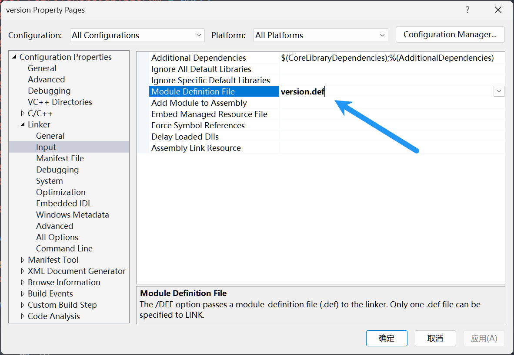

# Dll Hijacking with .h

## Environment

- Visual Studio 2022

## Hijack system dll

Note: This method does not apply to functions exported with special characters such as `?`, `@`, `$`. Please use other methods.

### Hijack 32-bit dll

1. Create an empty dll project, for example `version`.
2. Download this project and select the dll to hijack, for example `C:\Windows\SysWOW64\version.dll`.
3. Click the `Generate .h` button, select `x86`, and generate the h file to the project directory.
4. Add `#include "version.h"` in `dllmain.cpp`.
5. Call the `InitHijack` and `FreeHijack` functions to implement the hijacking.
6. Compile the project, generate the dll file, and copy it to the target directory.

### Hijack 64-bit dll

1. Create an empty dll project, for example `version`.
2. Download this project and select the dll to hijack, for example `C:\Windows\System32\version.dll`.
3. Click the `Generate .h` button, select `x64`, and check `Generate .def simultaneously`, generate the h file and def file to the project directory.
4. Add `#include "version.h"` in `dllmain.cpp`.
5. Right-click the project, select `Properties`, `Configuration Properties`, `Linker`, `Input`, `Module Definition File`, and add `version.def`.
   
6. Call the `InitHijack` and `FreeHijack` functions to implement the hijacking.
7. Compile the project, generate the dll file, and copy it to the target directory.

## Hijack custom dll

This method is also known as `dll proxy`, suitable for hijacking any dll, especially in scenarios where the original dll should exist.

1. Create an empty dll project.
2. Rename the dll to be hijacked, for example:
   - Rename `C:\Users\user\Desktop\test\my.dll` to `my_org.dll`
3. Download this project, select the **renamed** dll, click the `Generate .h` button, select `Custom dll`, and generate the h file to the project directory.
4. Include the generated h file in `dllmain.cpp`.
5. Compile the project, generate the dll file, rename it to `my.dll`, and copy it to the target directory.
   Note: The original dll `my_org.dll` must be in the same directory as the hijacked dll `my.dll`.
